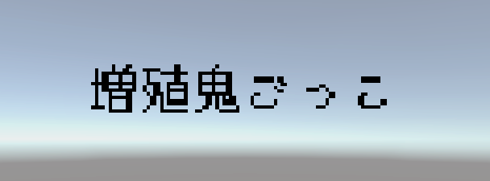
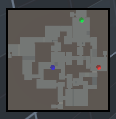

    

# 概要
『増殖鬼ごっこ』は、**時間が経過するほど鬼が増え続ける3D鬼ごっこゲーム**です。  
プレイヤーは事前に設定した時間、増え続ける鬼から逃げ切り、生還を目指します。  
**プレイ時間が長いほど鬼の出現数が増加し、難易度が上昇する**ため、戦略的な立ち回りと瞬時の判断が勝利の鍵を握ります。

# デモ映像
https://youtu.be/jbfkwxkh8Ic

# 推奨環境(テスト環境)
- Mac
  - プロセッサ：`2GHz クアッドコア Intel Core i5`
  - メモリ：`16GB`
  - グラフィックス：`Intel Iris Plus Graphics 1536MB`
- Windows

# 基本操作
## プレイヤーの移動
- **歩行**
    - WASD もしくは 上下左右キー
    

        
    

- **走行**
    - 上記 + Shift
    - 緑の人型ゲージはスタミナゲージ（[※詳細は以下](#スタミナ)）
    

        
    

## カメラ操作
- マウスで視点を操作できます（水平方向のみ）
    

        
    

# ゲームシステム
## プレイ時間設定
- タイトル画面からスタートするときにプレイヤー自身で設定可能  
- 長ければ長いほど出現する鬼の数が増えるので、難易度はその分増します  
    

        
    

## 鬼
- 一定時間が経過すると、フィールドのランダムな箇所に出現（Maxで15体出現）
- 基本的にフィールドを徘徊しているが、プレイヤーを発見すると見失うまで追跡
- 鬼はスタミナのないバケモノなので、アイテム（ポーション）を有効活用しなければ逃げ切ることが難しくなります
    

        
    

## スタミナ
プレイヤーは人間のため走ると疲れます
- 緑ゲージ
    - スタミナがある通常状態。この間、プレイヤーは走ることができる
- 赤ゲージ
    - スタミナがない疲労状態。この間、プレイヤーは走ることができない（ゲージは徐々に回復）
    

        
    

## ポーション
スタミナの縛りがあるプレイヤーを助けてくれる強力なアイテム
- 一定時間が経過すると、フィールドのランダムな箇所に出現
- 取得時から1分間、走り続けても疲労状態にならない
- この間ゲージは、その1分間のタイマーとして機能します
    

        
    

## ミニマップ
フィールドの形状と各要素の位置を確認可能  
- 青：プレイヤー
- 赤：鬼
- 緑：ポーション
    

        
    

# 使用技術
- **ゲームエンジン:** Unity 6.1 (6000.1.2f1) (C#)

# 開発期間
2025/7/2〜

